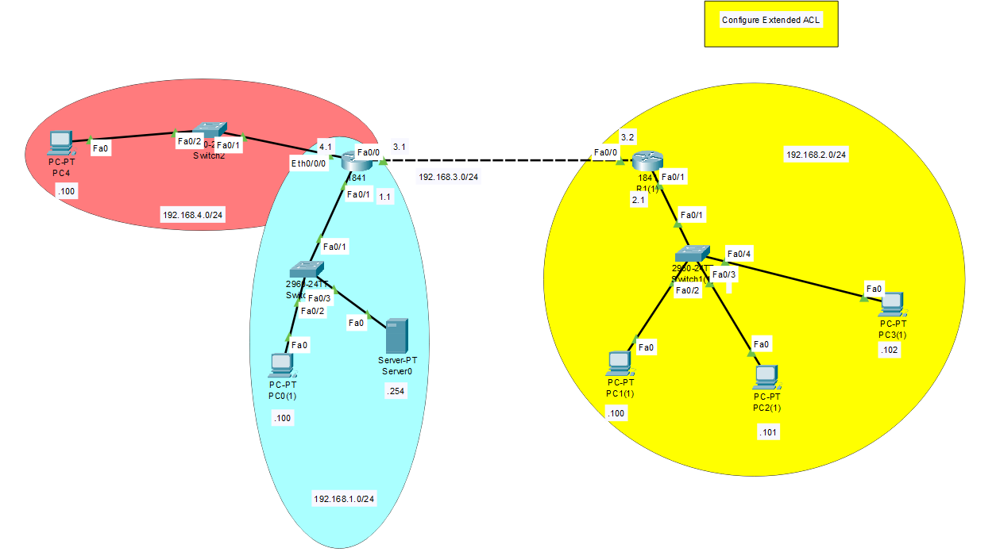

# IPv6 ACL Configuration

  
*Figure 1: Overview of ACL placement in network topology*


## Basic Router Configuration

### R1
```
hostname R1
int f0/0
ipv6 add FD00:1:1::FEED/48
ipv6 add FE80::1 Link-local 
no shut

int s0/0/0
ipv6 add FD00:12:12::1/48
ipv6 add FE80::1 Link-local 
clock rate 2000000
no shut

int s0/0/1
ipv6 add FD00:13:13::1/48
ipv6 add FE80::1 Link-local 
clock rate 2000000
no shut
```

### R2
```
hostname R2
int s0/0/0
ipv6 add FD00:12:12::2/48
ipv6 add FE80::2 Link-local
no shut

int f0/0
ipv6 add FD00:2:2::FEED/48
ipv6 add FE80::2 Link-local
no shut
```

### R3
```
hostname R3
int f0/0
ipv6 add FD00:3:3::FEED/48
ipv6 add FE80::3 Link-local 
no shut

int s0/0/0
ipv6 add FD00:13:13::2/48
ipv6 add FE80::3 Link-local 
no shut
```

## Enable Router RIP

### R1
```
ipv6 unicast-routing 
int f0/0
ipv6 rip process1 enable
int s0/0/0
ipv6 rip process1 enable
int s0/0/1
ipv6 rip process1 enable
```

### R2
```
ipv6 unicast-routing 
int s0/0/0
ipv6 rip process1 enable
int f0/0
ipv6 rip process1 enable
```

### R3
```
ipv6 unicast-routing 
int s0/0/0
ipv6 rip process1 enable
int f0/0
ipv6 rip process1 enable
```

## ACLs

### Rules
1. Deny Host1 access to FTP server
2. Deny Host2 access to HTTP/HTTPS server
3. Permit all other traffic

### Extended ACL Configuration on R1 (Named ACLs Only)

```
ipv6 access-list myfilter

# Deny FTP (Ports 20, 21) from Host1

deny tcp host FD00:1:1::1 host FD00:3:3::DEED eq ftp
deny tcp host FD00:1:1::1 host FD00:3:3::DEED eq 20

# Deny HTTP and HTTPS from Host2

deny tcp host FD00:1:1::2 host FD00:2:2::DEED eq www
deny tcp host FD00:1:1::2 host FD00:2:2::DEED eq 443

# Permit all other traffic

permit icmp any any
permit tcp any any
permit udp any any
permit ipv6 any any

# Apply ACL to interface

int f0/0
ipv6 traffic-filter myfilter in
```

### Verify ACLs
```
show ipv6 access-list
